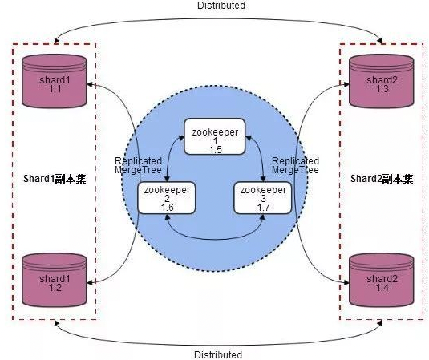

# 产品介绍
   UClickHouse为ClickHouse提供了一整套安全、稳定、可靠的托管服务，针对不同规模数据、硬件进行优化，并提供额外便捷的工具支持，使您在使用ClickHouse服务时不再需要为集群的配置、选型、故障、运维、开发工具等操心。

## UClickhouse数据仓库产品架构

服务架构如图：

UClickhouse设计为clickhouse集群+zookeeper集群。zookeeper集群与clickhouse集群分开部署。zookeeper设计为三节点集群，clickhouse设计为单集群，多分片，双副本结构。每个副本（节点）单独部署在云主机上，每台云主机只提供一个分片的副本服务。

## 产品特性

ClickHouse是面向联机分析处理的列式数据库，支持SQL查询，且查询性能好，特别是基于大宽表的聚合分析查询性能非常优异，比其他分析型数据库速度快一个数量级。

 * 数据压缩
 * 多核并行计算
 * 向量化计算引擎
 * 功能丰富的表引擎
 * 用户管理功能
 * 系统参数配置功能
 * 数据灵活迁移功能方便多种方式扩缩容
 * 服务监控

## 使用限制
 
 * 节点数必须是偶数
 * 最小提供1分片，2副本集群
 * 不支持用户自定义remote_servers配置，一个集群只有一个remote_servers，命名为：ch_cluster
 * 高可用必须使用 Replicated* 表引擎
