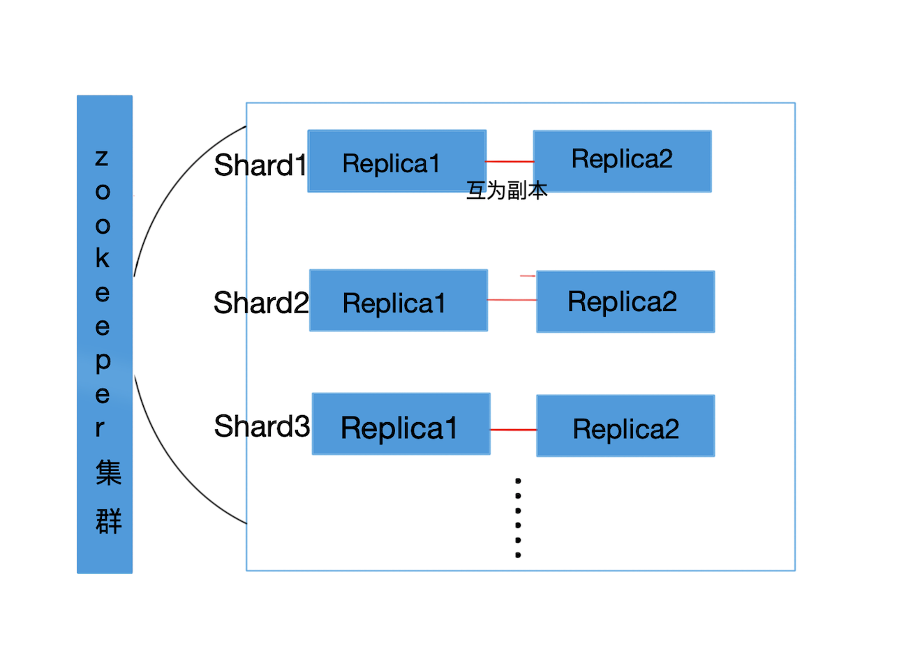

# 产品介绍
   UDW ClickHouse为开源列式数据库管理系统ClickHouse提供了一整套安全、稳定、可靠的托管服务，针对不同规模数据、硬件进行优化，并提供额外便捷的工具支持，使您在使用ClickHouse服务时不再需要为集群的配置、选型、故障、运维、开发工具等操心。

## UDW Clickhouse数据仓库产品架构

服务架构如图：

UDW Clickhouse设计为Clickhouse集群+Zookeeper集群。Zookeeper集群与Clickhouse集群分开部署。Zookeeper设计为三节点集群，Clickhouse设计为单集群，多分片，双副本结构。每个副本（节点）单独部署在云主机上，每台云主机只提供一个分片的副本服务。

## 产品特性

### 开箱即用

   控制台上简单的操作，数分钟就可以创建一个可以支撑TB-PB级别的数据仓库，同时很方便的进行配置参数变更、账号管理等操作。

### 高性能分析

   UDW ClickHouse是基于开源ClickHouse的优异查询性能，面向联机分析处理的列式数据库，支持SQL查询，且查询性能好，特别是基于大宽表的聚合分析查询性能非常优异，比其他分析型数据库速度快一个数量级。

### 智能运维

   通过完善的监控体系、结合专业的运维工具，及时的发现并排除风隐患、有效的降低故障率、提供系统的稳定性。

### 低成本

   充分利用云上资源优势，结合ClickHouse本身特性，可以按需申请分片个数，无需为搭建数仓一次性投入高额成本，同时减低运维人力成本。

## 使用限制

 * 节点数必须是偶数
 * 最小提供1分片，2副本集群
 * 不支持用户自定义remote_servers配置，一个集群只有一个remote_servers，命名为：ch_cluster
 * 高可用必须使用 Replicated* 表引擎
