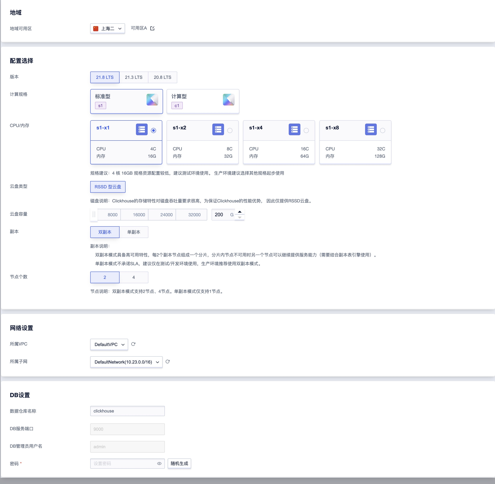
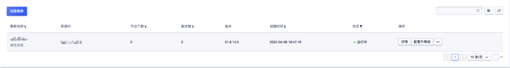
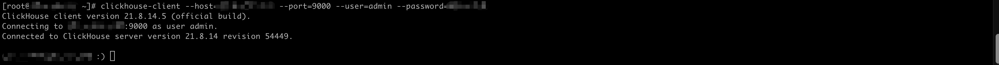
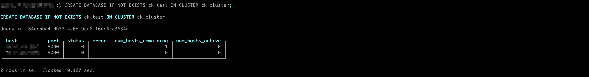
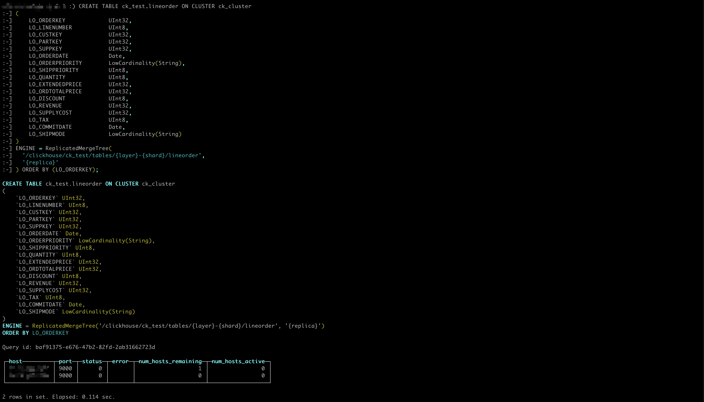
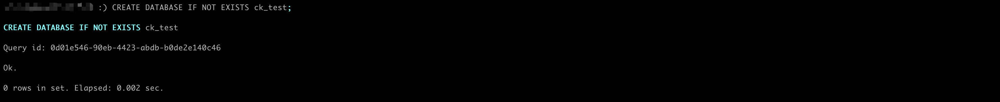
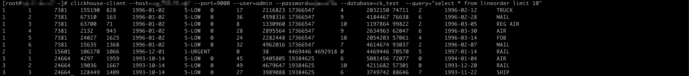
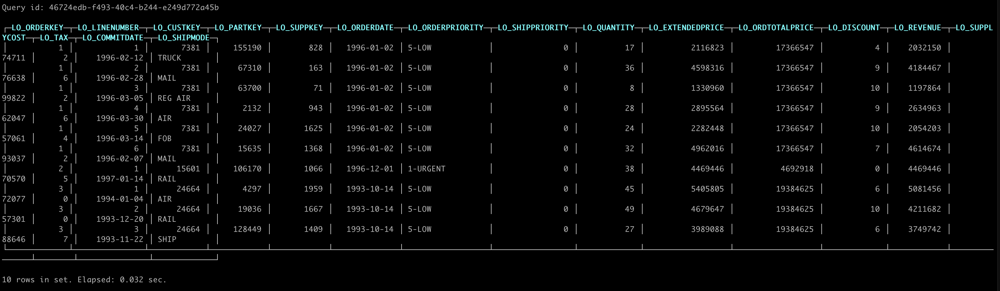

# 快速开始

## 创建集群
1.登录Ucloud账号进入到[用户控制台](https://passport.ucloud.cn/#login)，在全部产品下搜索或者数据仓库下选择“数据仓库 UDW Clickhouse”，进入到数据仓库 UClickhouse控制台下。


2.点击创建集群，进入集群创建页，按照实际需要根据页面提示，选择所需规格配置并购买。各配置项说明见配置说明。



#### 配置项说明

<table>
    <thead>
    <tr>
        <th>配置项</th>
        <th>说明</th>
    </tr>
    </thead>
    <tbody>
    <tr>
        <td>地域</td>
        <td>
            暂支持地域华北一、上海二、广州、香港、新加坡、东京，建议按业务就近原则选择合适地域。
            <p class="tip">注意：一旦地域选定，购买成功后无法进行修改。</p>
        </td>
    </tr>
    <tr>
        <td>可用区</td>
        <td>不同可用区处于不同的地理区域，根据实际情况选择。</td>
    </tr>
    <tr>
        <td>版本</td>
        <td>按实际需要选择内核版本</td>
    </tr>
    <tr>
        <td>CPU/内存</td>
        <td>
            支持标准型、计算型两种计算规格可按业务实际需要选择计算规格。建议生产环境选择高一点的资源配置规格。
            <blockquote>
                <ul>
                    <li>标准型：4核16G、8核32G、16核64G、32核128G。</li>
                    <li>计算型：8核16G、16核32G、32核64G、64核128G</li>
                </ul>
            </blockquote>
        </td>
    </tr>
    <tr>
        <td>云盘类型</td>
        <td>Clickhouse的存储特性对磁盘吞吐量要求很高，为保证Clickhouse的性能优势， 仅提供RSSD云盘。</td>
    </tr>
    <tr>
        <td>云盘容量</td>
        <td>集群默认云盘容量为200G，最大支持32000G，如存储数据量比较庞大，建议增加容量。</td>
    </tr>
    <tr>
        <td>副本</td>
        <td>
            双副本模式具备高可用特性，每2个副本节点组成一个分片，分片内节点不可用时另一个节点可以继续提供<br />服务能力（需要结合副本表引擎使用）。<br/>
            单副本模式不承诺SLA，建议仅在测试/开发环境使用，生产环境推荐使用双副本模式。
        </td>
    </tr>
    <tr>
        <td>节点个数</td>
        <td>双副本模式支持2节点、4节点。单副本模式仅支持1节点。</td>
    </tr>
    <tr>
        <td>网络</td>
        <td>
            VPC（Virtual Private Cloud）是属于用户的、逻辑隔离的网络环境。<br />
            各地域我们会创建默认VPC和默认子网，用户可直接将集群创建在默认VPC中
        </td>
    </tr>
    </tbody>
</table>

## 查看集群信息

集群创建并启动成功后，您可进入到数据仓库 UClickhouse控制台下，选择集群所在地域可用区后，可查看集群列表和详情信息。




## 使用云数据仓库UClickhouse

### 连接集群

- 在集群所在地域（同一网段）下建立一台云主机，在云主机上安装Clickhouse-client，官方下载地址：[下载Clickhouse-client](https://packages.clickhouse.com/rpm/lts/)。

  建议按实际创建的内核版本选择对应版本的Clickhouse-client，如以上创建的集群内核版本为22.8.2.11，则下载如下rpm包：

  ```
  wget https://packages.clickhouse.com/rpm/lts/clickhouse-client-22.8.2.11.x86_64.rpm
  wget https://packages.clickhouse.com/rpm/lts/clickhouse-common-static-22.8.2.11.x86_64.rpm
  ```

- 执行安装

  ```shell
  rpm -ivh clickhouse-common-static-22.8.2.11.x86_64.rpm
  rpm -ivh clickhouse-client-22.8.2.11.x86_64.rpm
  ```

- 通过clickhouse-client连接集群

  ```shell
  clickhouse-client --host=<任一节点IP地址> --port=9000 --user=admin --password=<创建集群时设置的密码>
  ```

  

  以上命令将进入交互模式。用户名默认admin、端口默认9000，节点IP可到集群详情查看。

## 创建数据库及数据表

使用clickhouse-client进入交互模式连接集群执行DDL语句

- 双副本模式下建库建表

```sql
CREATE DATABASE IF NOT EXISTS ck_test ON CLUSTER ck_cluster;
CREATE TABLE ck_test.lineorder ON CLUSTER ck_cluster 
(
    LO_ORDERKEY             UInt32,
    LO_LINENUMBER           UInt8,
    LO_CUSTKEY              UInt32,
    LO_PARTKEY              UInt32,
    LO_SUPPKEY              UInt32,
    LO_ORDERDATE            Date,
    LO_ORDERPRIORITY        LowCardinality(String),
    LO_SHIPPRIORITY         UInt8,
    LO_QUANTITY             UInt8,
    LO_EXTENDEDPRICE        UInt32,
    LO_ORDTOTALPRICE        UInt32,
    LO_DISCOUNT             UInt8,
    LO_REVENUE              UInt32,
    LO_SUPPLYCOST           UInt32,
    LO_TAX                  UInt8,
    LO_COMMITDATE           Date,
    LO_SHIPMODE             LowCardinality(String)
)
ENGINE = ReplicatedMergeTree(
  '/clickhouse/ck_test/tables/{layer}-{shard}/lineorder',
  '{replica}'
) ORDER BY (LO_ORDERKEY);
```





- 单副本模式下建库建表

```sql
CREATE DATABASE IF NOT EXISTS ck_test;
CREATE TABLE ck_test.lineorder 
(
    LO_ORDERKEY             UInt32,
    LO_LINENUMBER           UInt8,
    LO_CUSTKEY              UInt32,
    LO_PARTKEY              UInt32,
    LO_SUPPKEY              UInt32,
    LO_ORDERDATE            Date,
    LO_ORDERPRIORITY        LowCardinality(String),
    LO_SHIPPRIORITY         UInt8,
    LO_QUANTITY             UInt8,
    LO_EXTENDEDPRICE        UInt32,
    LO_ORDTOTALPRICE        UInt32,
    LO_DISCOUNT             UInt8,
    LO_REVENUE              UInt32,
    LO_SUPPLYCOST           UInt32,
    LO_TAX                  UInt8,
    LO_COMMITDATE           Date,
    LO_SHIPMODE             LowCardinality(String)
)
ENGINE = MergeTree ORDER BY (LO_ORDERKEY);
```




## 准备数据并导入

创建csv文件lineorder.csv放到之前创建的云主机数据盘/data目录下

```
1,1,7381,155190,828,"1996-01-02","5-LOW",0,17,2116823,17366547,4,2032150,74711,2,"1996-02-12","TRUCK",
1,2,7381,67310,163,"1996-01-02","5-LOW",0,36,4598316,17366547,9,4184467,76638,6,"1996-02-28","MAIL",
1,3,7381,63700,71,"1996-01-02","5-LOW",0,8,1330960,17366547,10,1197864,99822,2,"1996-03-05","REG AIR",
1,4,7381,2132,943,"1996-01-02","5-LOW",0,28,2895564,17366547,9,2634963,62047,6,"1996-03-30","AIR",
1,5,7381,24027,1625,"1996-01-02","5-LOW",0,24,2282448,17366547,10,2054203,57061,4,"1996-03-14","FOB",
1,6,7381,15635,1368,"1996-01-02","5-LOW",0,32,4962016,17366547,7,4614674,93037,2,"1996-02-07","MAIL",
2,1,15601,106170,1066,"1996-12-01","1-URGENT",0,38,4469446,4692918,0,4469446,70570,5,"1997-01-14","RAIL",
3,1,24664,4297,1959,"1993-10-14","5-LOW",0,45,5405805,19384625,6,5081456,72077,0,"1994-01-04","AIR",
3,2,24664,19036,1667,"1993-10-14","5-LOW",0,49,4679647,19384625,10,4211682,57301,0,"1993-12-20","RAIL",
3,3,24664,128449,1409,"1993-10-14","5-LOW",0,27,3989088,19384625,6,3749742,88646,7,"1993-11-22","SHIP",
```

使用clickhouse-client非交互模式执行以下命令导入数据

```shell
clickhouse-client --host=<任一节点IP地址> --port=9000 --user=admin --password=<创建集群时设置的密码> --database=ck_test  --query "INSERT INTO lineorder FORMAT CSV" < /data/lineorder.csv
```

## 查询数据

- 使用clickhouse-client非交互模式执行查询

  ```
  clickhouse-client --host=<任一节点IP地址> --port=9000 --user=admin --password=<创建集群时设置的密码> --database=ck_test  --query="select * from lineorder"
  ```



- 使用clickhouse-client交互模式执行查询

  ```
  clickhouse-client --host=<任一节点IP地址> --port=9000 --user=admin --password=<创建集群时设置的密码> --database=ck_test
  ```

  

- 使用http,端口使用8123进行查询

  ```
  echo "select * from ck_test.lineorder"  |  curl  'http://用户名:密码@任一节点IP地址:8123/' --data-binary @-
  ```


