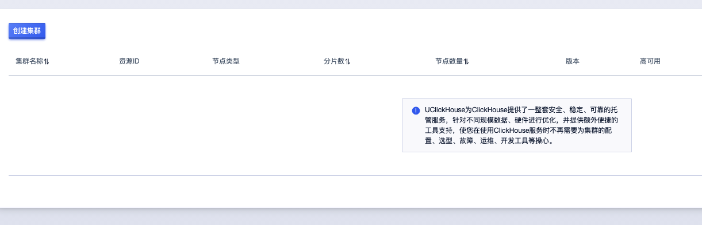
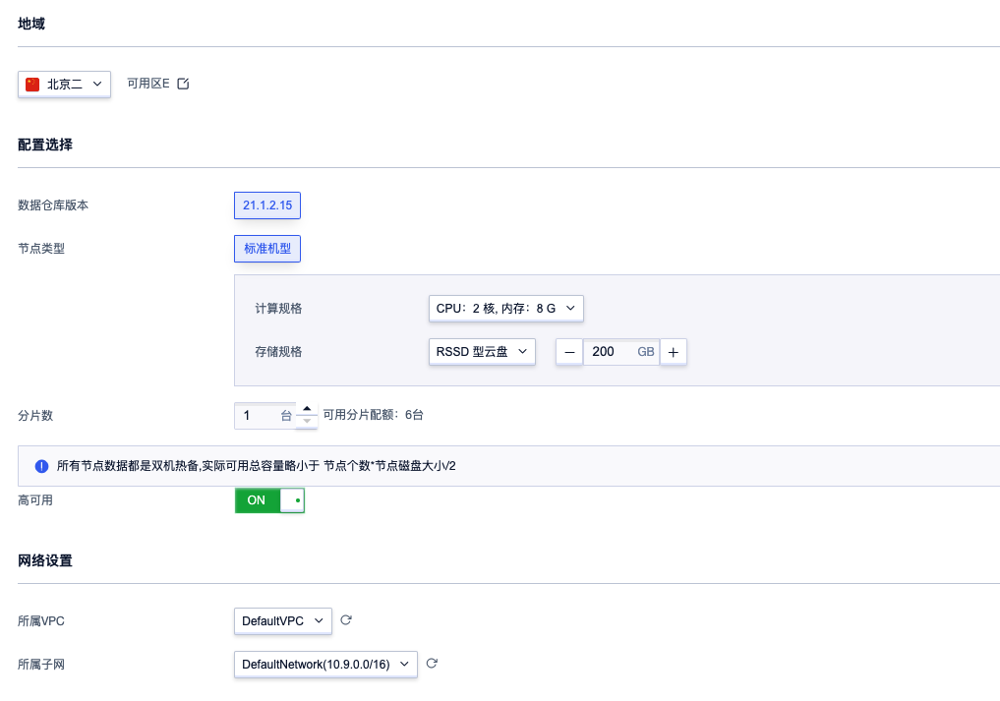
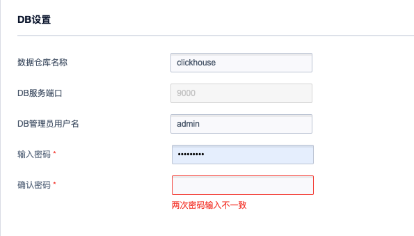
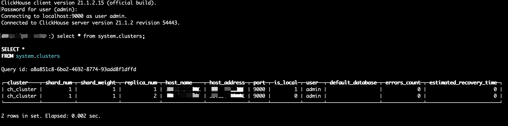

# 快速开始

## 一、创建数据库
1.控制台所有产品搜索或在数据分析类别下找到 "云数据仓库UClickHouse"，点击进入UClickHouse控制台：



2.点击创建集群，选择相应配置：



可选配置：
计算规格
|    cpu     |   内存     |                 
|------------|------------|
|    2核     |    8G      |
|    4核     |    16G     | 
|    8核     |    32G     | 
|    16核    |    64G     | 
|    32核    |    128G    |
|    64核    |    256G    |

存储规格

|  磁盘类型  |     可选范围    |
|------------|-----------------|
|  普通云盘  |   100 - 8000GB  |       
|  RSSD云盘  |   100 - 32000GB |

3.创建admin账号：

默认为用户初始化一个管理员权限的admin账号，确认输入密码。



4.选择付费方式，确认支付：

5.等待服务创建和部署，数据仓库规模不同，所需要的创建时间会有所差异。

## 二、连接数据仓库

UClickHouse默认为用户开放了tcp9000端口、http8123端口以及mysql9004端口等来连接

### TCP访问UClickHouse服务

在UClickHouse产品相同可用区下创建一台云主机，下载相同版本的客户端访问工具并安装：

下载客户端:

下载对应版本common-static和client的rpm包
[https://repo.yandex.ru/clickhouse/rpm/stable/x86_64/](https://repo.yandex.ru/clickhouse/rpm/stable/x86_64/)

安装:
```
rpm‐ivhclickhouse‐common‐static‐21.1.2.15‐2.x86_64.rpm 
rpm‐ivhclickhouse‐client‐21.1.2.15‐2.noarch.rpm
``` 
在集群详情页查询节点列表，访问任一节点服务:
```
clickhouse‐client ‐h node_ip ‐u admin‐‐password

```  
输入密码，成功登陆服务，查看clickhouse集群服务信息:



