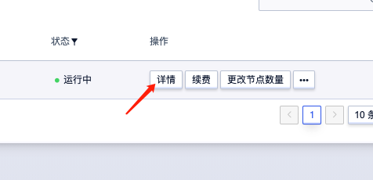
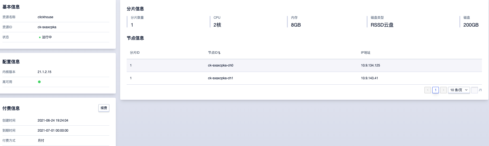
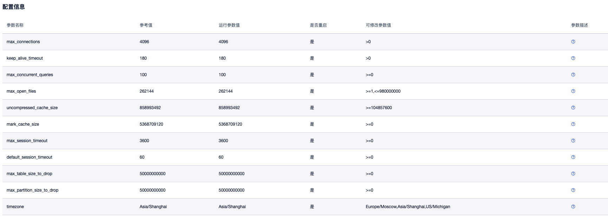
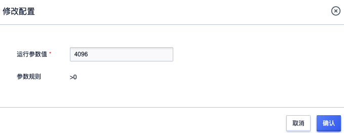
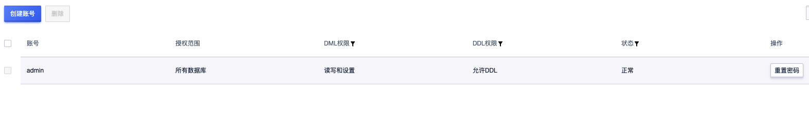
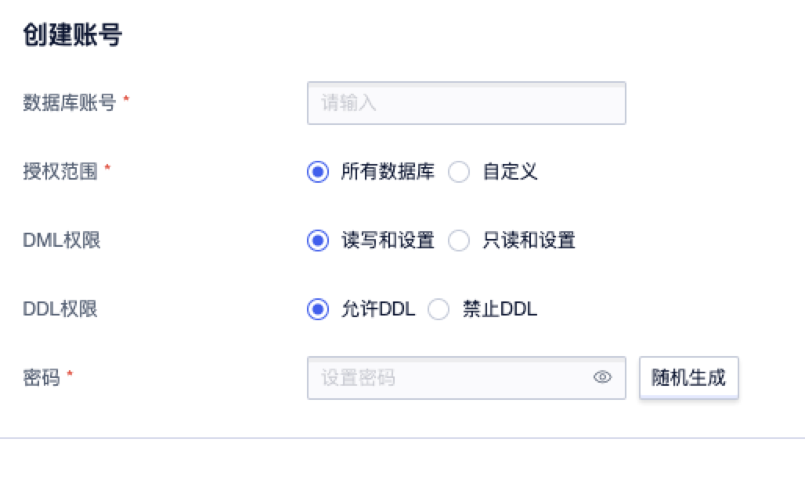
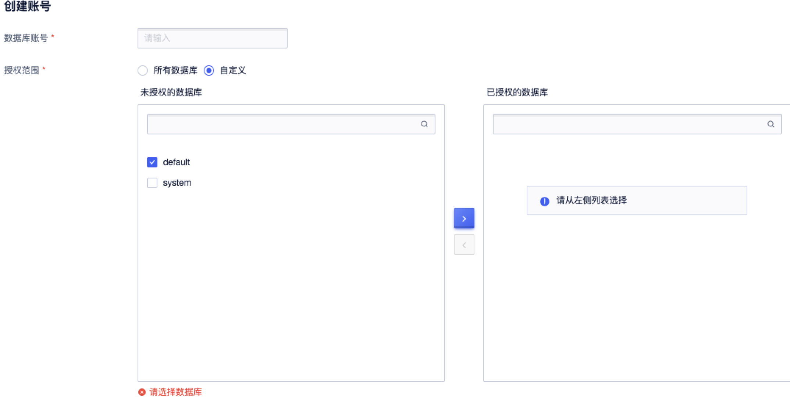
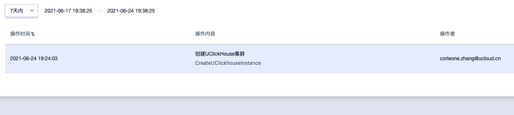
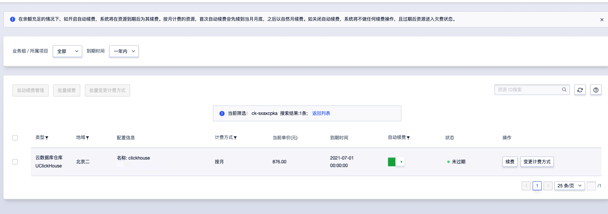

# 操作指南

## 查看数据库详情

点击 "详情" 进入二级页面。

该页面上可以看到数据仓库的详细信息，包括集群基本信息、服务信息、配置信息、节点列表；上方展示了集群服务的功能。点击资源名称可对其进行修改。

## 配置管理功能

点击配置管理进入配置管理功能页面，对集群全局参数进行配置

选定要修改的若干参数进行修改，然后即可批量应用到集群（需要重启集群）或者取消修改

## 用户管理功能

集群创建初始化已经为用户创建一个管理员权限的admin账户，此账户为用户所有权限账户，不可删除修改

点击创建一个普通账号，设置各种权限：

选择数据库权限：

## 查看操作日志

## 查看监控

## 续费

详情页付费信息点击续费进入账单页面，查看账单信息进行续费

