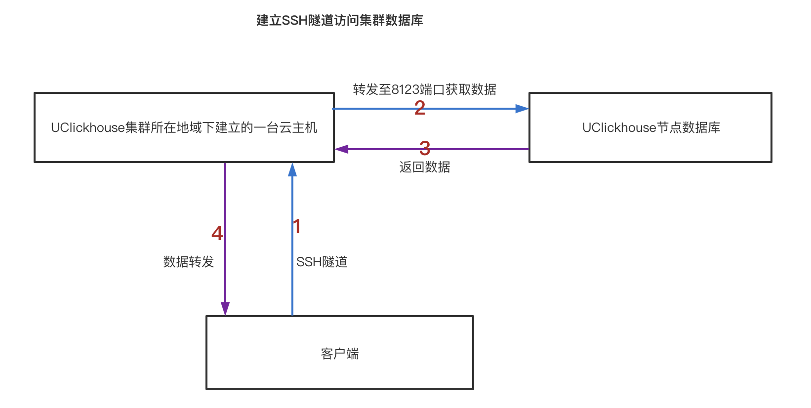
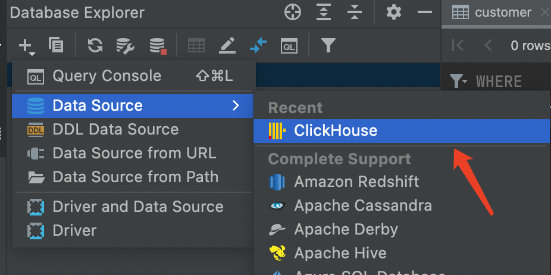
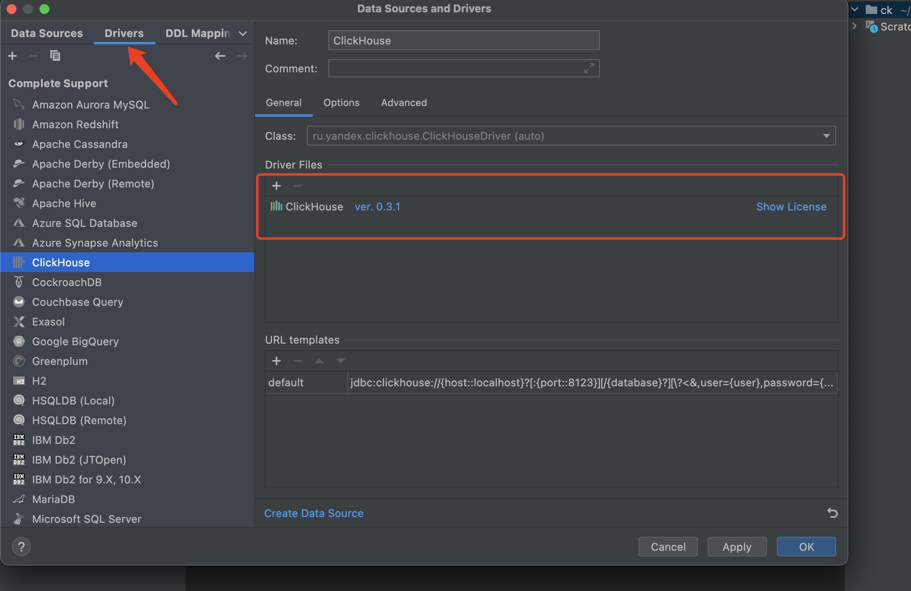
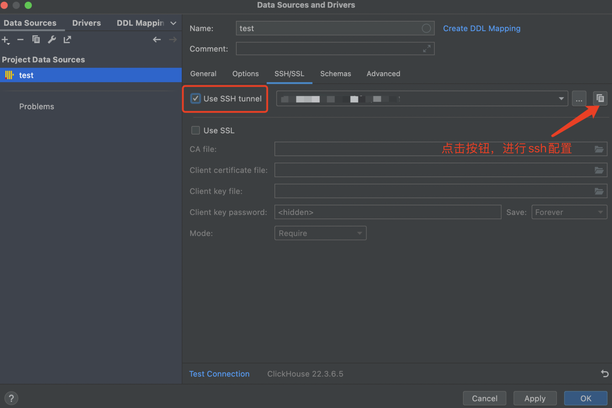
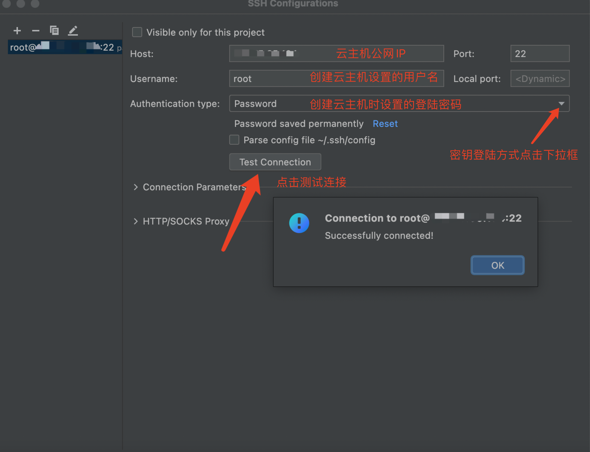
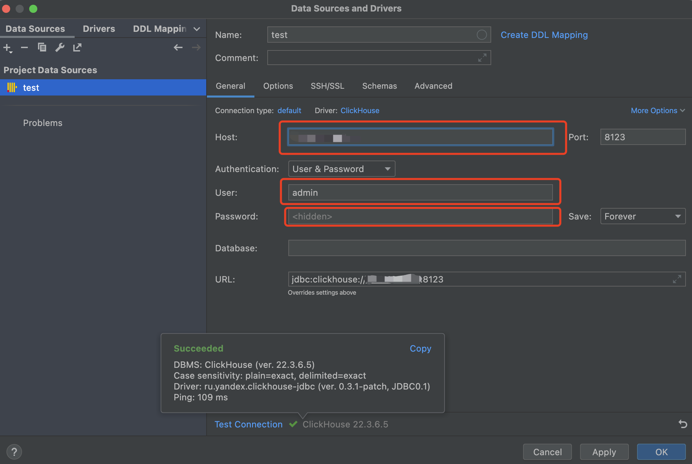
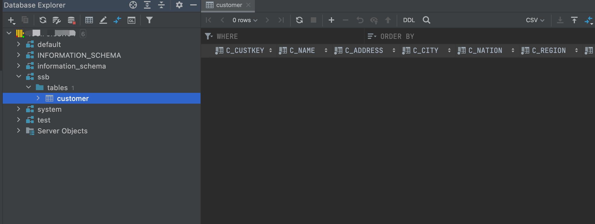

# 可视化工具连接集群

UClickhouse可以通过第三方客户端工具连接实例，针对有数据可视化操作需求的场景，您可以使用常用的DataGrip工具连接集群，进行数据操作。以下为使用DataGrip工具连接集群的步骤及操作示例。

### DataGrip简介

[DataGrip](https://www.jetbrains.com/datagrip/) 是JetBrains的数据库IDE，专门支持ClickHouse。 此工具支持ClickHouse语法高亮显示；支持ClickHouse特有的功能，例如嵌套列，表引擎；支持数据编辑等功能

### 通过SSH隧道连接集群数据库介绍

说明：

1:需要在UClickhouse集群所在地域（同一网段）下建立一台云主机。

2:UClickhouse节点IP查看：登录UCloud账号进入到[用户控制台](https://passport.ucloud.cn/#login)，在全部产品下搜索或者数据仓库下选择“数据仓库 UDW Clickhouse”，进入到[数据仓库 UClickhouse控制台](https://console.ucloud.cn/udw/clickhouse)。在**集群列表**页面，点击**详情**可查看集群节点列表，列表中已列出节点地址。

3:SSH 隧道能够提供两大功能:（1）加密 SSH Client 端至 SSH Server 端之间的通讯数据（2）突破防火墙的限制完成一些之前无法建立的 TCP 连接加密 SSH Client 端至 SSH Server 端之间的通讯数据

### 操作步骤

  1. 根据本地操作系统类型下载DataGrip工具，官方下载地址：[下载DataGrip](https://www.jetbrains.com/datagrip/)。下载后自行安装即可。

  2. 打开DataGrip,创建ClickHouse数据源，如下图

     

  3. 填写连接信息之前先下载系统默认的驱动，如下图

     

  4. 出于安全考虑，远程主机上的9000端口并没有对外开放，因此DataGrip需要进行ssh通道连接ClickHouse数据库。DataGrip通过ssh连接远程ClickHouse的方式如下图

     (1) 先切到"SSH/SSL"页面，使用ssh连接上**同一地域下的云主机**，如果登陆云主机是私钥文件，则Auth type 选择 Key pair（OpenSSH or PuTTY）。

     

     

     （2）切回"General"页面，在该页面输入集群节点相应的信息。（点击Test Connection 即可）如下图

     节点信息获取：登录UCloud账号进入到[用户控制台](https://passport.ucloud.cn/#login)，在全部产品下搜索或者数据仓库下选择“数据仓库 UDW Clickhouse”，进入       到[数据仓库 UClickhouse控制台](https://console.ucloud.cn/udw/clickhouse)。在**集群列表**页面，点击**详情**可查看集群节点列表，列表中已列出节点地址

     

  5. 连接完成，此时在连接列表中就可以使用该数据库进行您需要的操作了。

     

     

字段说明：

1:General页面参数说明

| 参数     | 说明                         |
| -------- | ---------------------------- |
| host     | clickhouse集群节点的ip地址。 |
| port     | 8123                         |
| user     | 管理用户名，默认admin        |
| password | 您创建集群时设置的管理密码   |

2:SSH/SSL页面参数说明

| 参数                | 说明                                                         |
| ------------------- | ------------------------------------------------------------ |
| host                | UClickhouse集群所在地域（同一网段）下建立的一台云主机IP地址  |
| port                | 22                                                           |
| user                | 登陆用户名，默认root                                         |
| Authentication type | 如果登陆云主机是私钥文件,则Auth type 选择 Key pair（OpenSSH or PuTTY） 登陆云主机是密码，则Auth type选择Password |

