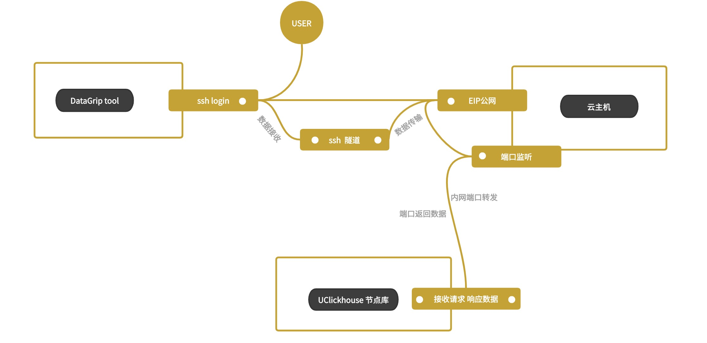
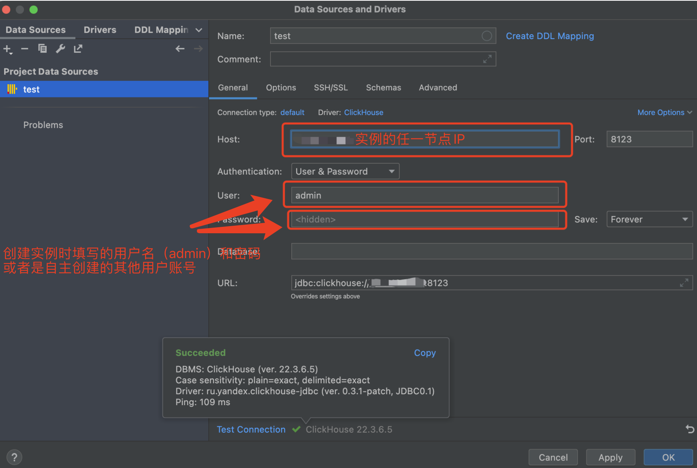

# 可视化工具连接集群

UClickhouse可以通过第三方客户端工具连接实例，针对有数据可视化操作需求的场景，您可以使用常用的DataGrip工具连接集群，进行数据操作。以下为使用DataGrip工具连接集群的步骤及操作示例。

### DataGrip简介

[DataGrip](https://www.jetbrains.com/datagrip/) 是JetBrains的数据库IDE，兼容支持连接Clickhouse。 此工具支持ClickHouse语法高亮显示；支持ClickHouse特有的功能，例如嵌套列，表引擎；支持数据编辑等功能。

### 通过SSH隧道连接集群数据库介绍

说明：

1：需要有一台能够直接通过SSH连接的Linux主机，并且该主机和UClickhouse实例的网络是可以相互连通的。

2：登录UCloud控制台，查看[数据仓库 UClickhouse列表](https://console.ucloud.cn/udw/clickhouse)。点击详情查看目标实例的节点信息。

### 操作步骤

  1. 根据本地操作系统类型下载DataGrip工具，官方下载地址：[下载DataGrip](https://www.jetbrains.com/datagrip/)。下载后自行安装即可。

  2. 打开DataGrip,创建ClickHouse数据源，如下图

     

  3. 填写连接信息之前先下载系统默认的驱动，如下图

     

  4. 出于安全考虑，UClickHouse实例不支持公网直接连接，因此DataGrip需要通过SSH通道连接UClickHouse实例的节点。DataGrip通过SSH连接UClickHouse节点的方式如下图

     (1) 先切到"SSH/SSL"页面，使用ssh连接上准备好的云主机，如果登陆云主机是私钥文件，则Auth type 选择 Key pair（OpenSSH or PuTTY）。

     

     

     （2）切回"General"页面，在该页面输入集群节点相应的信息。（点击Test Connection 即可）如下图

     节点信息获取：登录UCloud控制台，查看[数据仓库 UClickhouse列表](https://console.ucloud.cn/udw/clickhouse)。点击详情查看目标实例的节点信息

     

  5. 连接完成，此时在连接列表中就可以使用该数据库进行您需要的操作了。

     

     

字段说明：

1:General页面参数说明

| 参数     | 说明                        |
| -------- | --------------------------- |
| host     | UClickhouse集群节点的ip地址 |
| port     | 8123                        |
| user     | 管理用户名，默认admin       |
| password | 您创建集群时设置的管理密码  |

2:SSH/SSL页面参数说明

| 参数                | 说明                                                         |
| ------------------- | ------------------------------------------------------------ |
| host                | 能够直接通过SSH连接的Linux主机，并且该主机和UClickhouse实例的网络是可以相互连通 |
| port                | 22                                                           |
| user                | 登陆用户名，默认root                                         |
| Authentication type | 如果登陆云主机是私钥文件,则Auth type 选择 Key pair（OpenSSH or PuTTY） 登陆云主机是密码，则Auth type选择Password |

